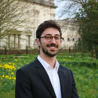
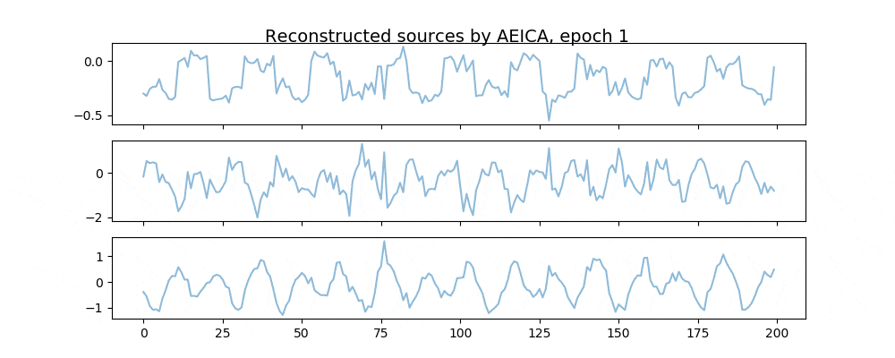
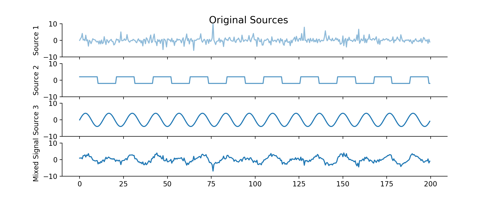

## About Me

I am a master's student at the University of Cambridge studying physics and machine learning. 

## Research Interest

I am generally interested in how machine learning can be used to inform physics (particle and quantum) and be used to improve physical experiment. I currently work on creating generative modeling approaches to particle detector simulation for high energy physics events. I work in the ATLAS group here at Cambridge on such models.

## Fun ML toys

### Autoencoding Independence with Coulomb GANs

Enforce independence in the latent space of autoencoder: 

