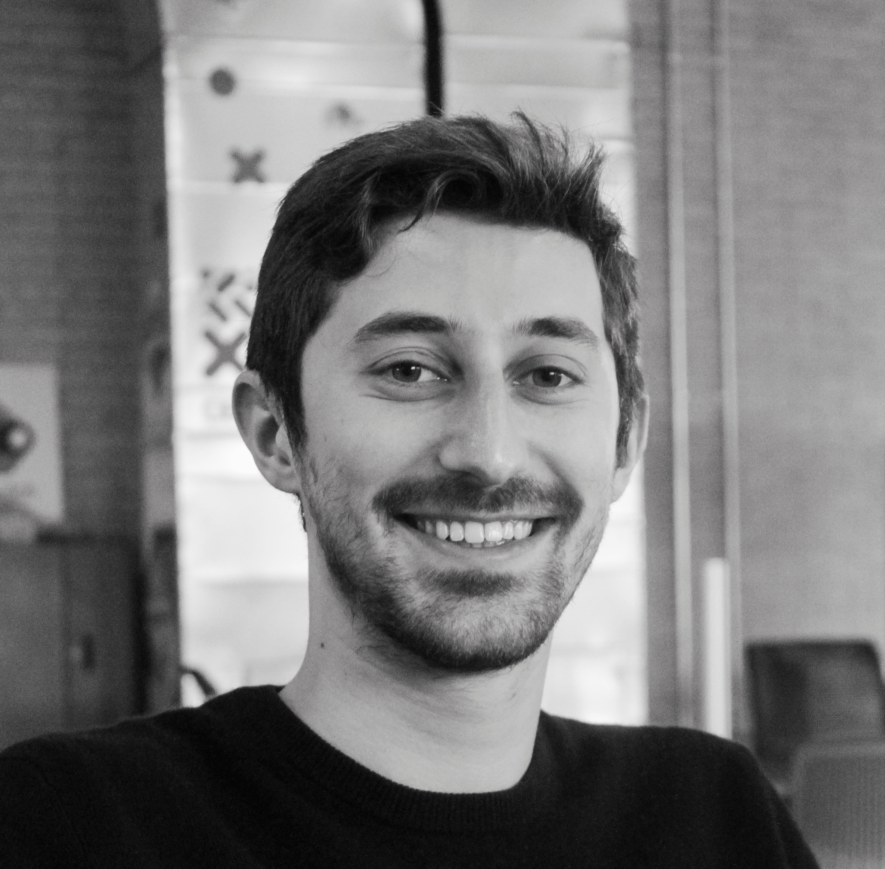
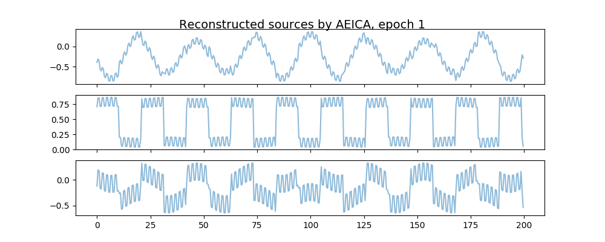
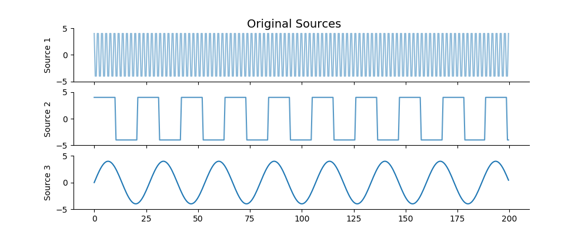

## About Me

I am a master's student at the University of Cambridge studying physics and machine learning. I'll be moving to the Perimeter Institute as a graduate fellow in the coming months.

<!-- ## Research Interest

I am generally interested in how machine learning can be used to inform physics (particle and quantum) and be used to improve physical experiment. I currently work on creating generative modeling approaches to particle detector simulation for high energy physics events. I work in the ATLAS group here at Cambridge on such models.
 -->

## Some Documents

11/2018: Here is a copy of my [master's thesis](https://github.com/malbergo/mastersthesis_final/blob/master/ThesisMichaelAlbergov_FINALRevised.pdf). 

 * A brief and simplified overview of the work [can be found here](https://medium.com/@michaelsalbergo/toward-pragmatic-generative-modeling-of-particle-physics-calorimeter-signals-ad38579be2fa).

 09/2018: Slides for work on independence enforcement in latent spaces of autoencoders [can be found here](FinalPresentationMicrosoft.pptx)

## Fun ML toys

### Autoencoding Independence with Coulomb GANs

Enforce independence in the latent space of autoencoder: 

 

### Autoencoding Independence with d-Hilbert Schmidt Independence Criteria

